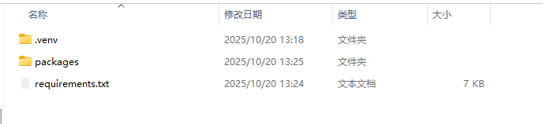
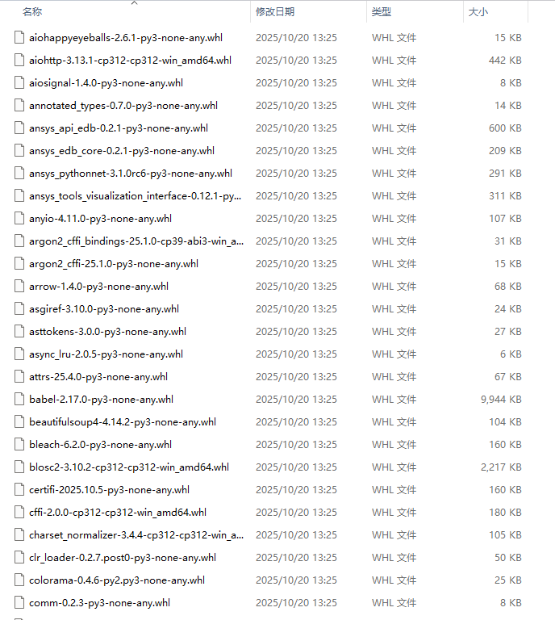
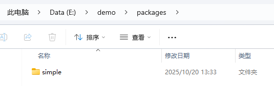
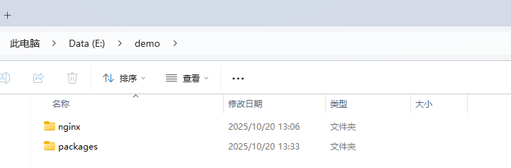
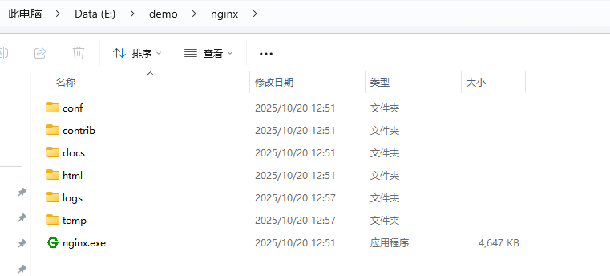
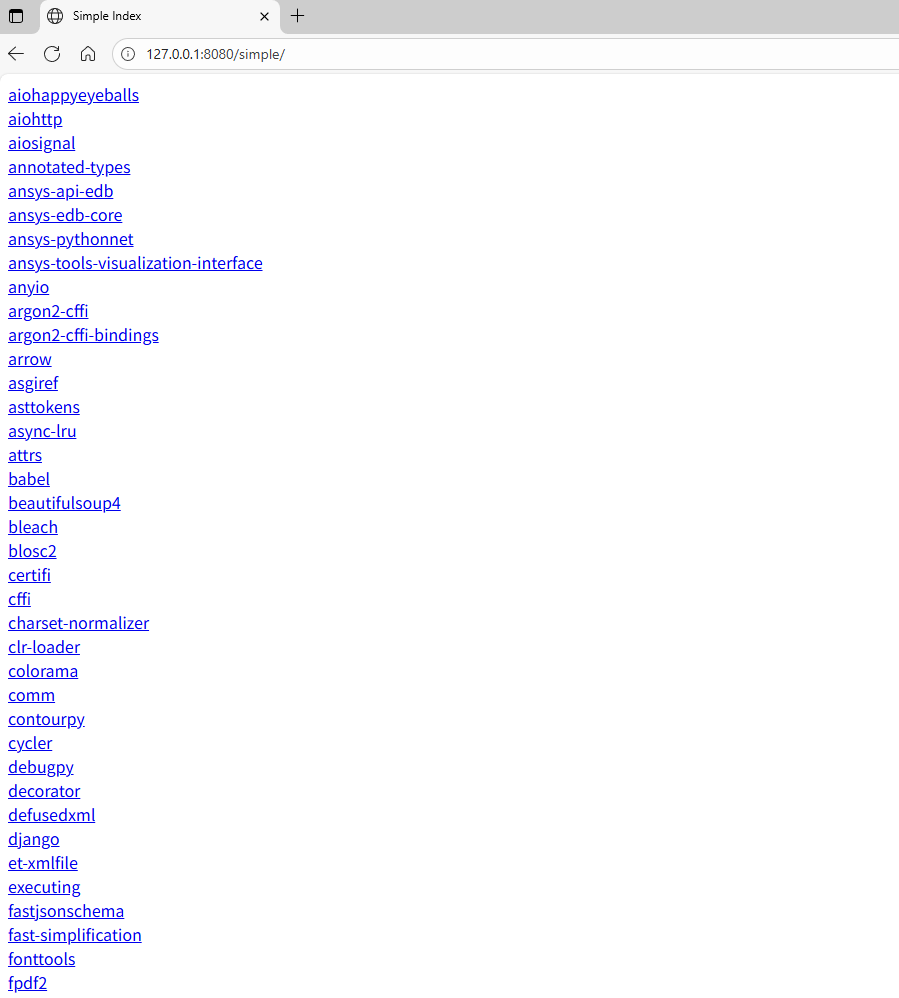

# Windows 构建局域网内的PIP镜像

## 第一阶段

如下步骤需要在一台可以联网的Windows操作系统上操作。

此处以PyAEDT为例（**需提前自行手动安装Windows版本的Python**）

### 新建一个文件夹
例如我的文件夹路径是 `D:\test` （**完整路径中不能出现中文！！！很重要**）。打开Windows终端，输入如下命令：
```bash
 cd D:\test
```
### 创建Python Venv环境
```bash
 python -m venv .venv
```
### 激活 Venv环境
```bash
 .venv\Scripts\activate
```
### 安装 PyAEDT
```bash
 pip install -i https://mirrors.ustc.edu.cn/pypi/simple pyaedt[all]
```
### 得到所有依赖包的信息
```bash
 pip freeze > requirements.txt
```
### 下载所有依赖的包到指定文件夹
```bash
pip download -d packages -r requirements.txt --trusted-host https://mirrors.ustc.edu.cn/pypi/simple
```
于是你便可以在 `D:\test` 看到一个叫 `packages` 文件夹，并且文件夹中包含了所依赖的Python包。


### 安装 pip2pi 模块 
其主要功能是将本地的模块包进行索引管理。
```bash
 pip install pip2pi
```
### 创建索引
```bash
 dir2pi -S ./packages
```
完成之后进入文件夹  `D:\test\packages\simple`，双击 index.html 可以看到索引效果。

## 第二阶段

### 拷贝simple文件夹
在离线环境中创建一个文件夹，我这里叫做 `D:\demo`， 同时创建一个文件夹叫 `packages`。
将第一阶段最终产生的 `simple` 文件夹拷贝到离线环境中的`D:\demo\packages`，接下来在离线环境中进行配置。



### 复制Nginx软件
将提供的Nginx软件解压缩，并复制到 `D:\demo` 文件夹中。


`D:\demo\nginx`文件夹下的内容



### 配置Nginx选项
用文本编辑器打开 `E:\demo\nginx\conf\nginx.conf` 。修改第39行出的代码, 并保存。

```
server {
    listen       8080;
    server_name  localhost;

    root E:/demo/packages;
    index index.html;

}
```

- `root` 后面空一格，填入 `packages`文件夹的完整路径，由于Windows的文件夹层级是使用 `\` 符号，我们需要将`\`改为 `/`。例如此处我的完整路径是 `E:\demo\packages`，应该修改为 `E:/demo/packages`

### 运行Nginx软件

```bash
 cd E:\demo\nginx
 .\nginx.exe
```

### 浏览器打开验证是否安装成功

请用浏览器打开 `http://127.0.0.1:8080/simple/`, 如果顺利安装的话，则可以在浏览器中看到如下页面：



### 使用镜像

```bash
# 临时指定，并安装
pip install xxx -i http://127.0.0.1:8080/simple/

# 永久指定，并安装
pip config set global.index-url http://127.0.0.1:8080/simple/
pip install xxx
```